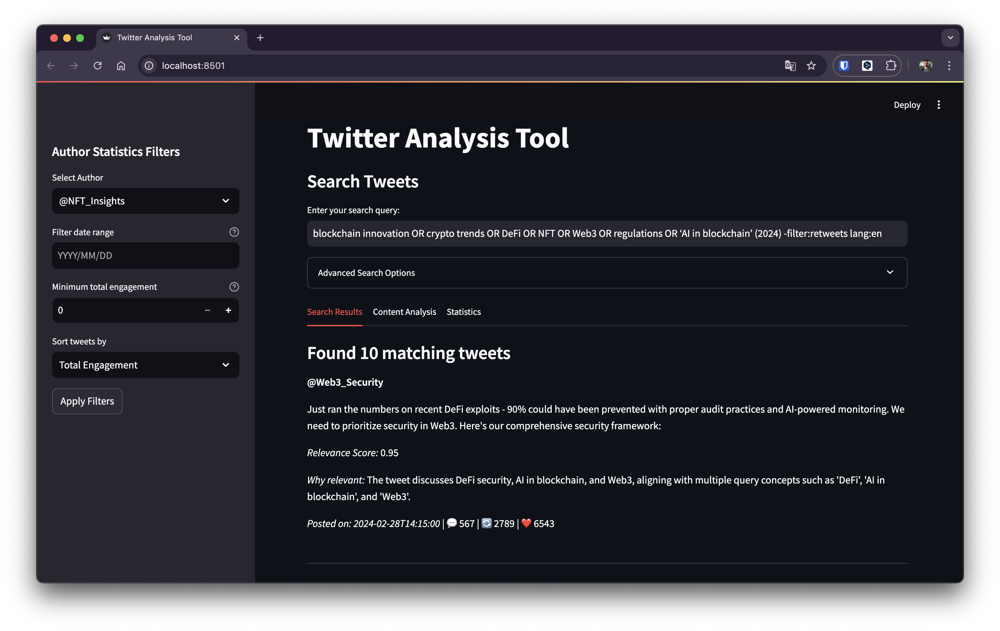
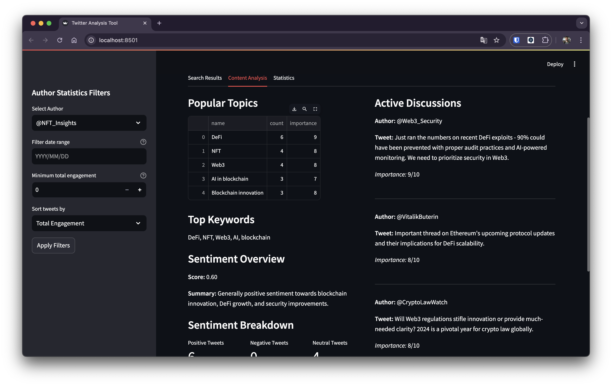
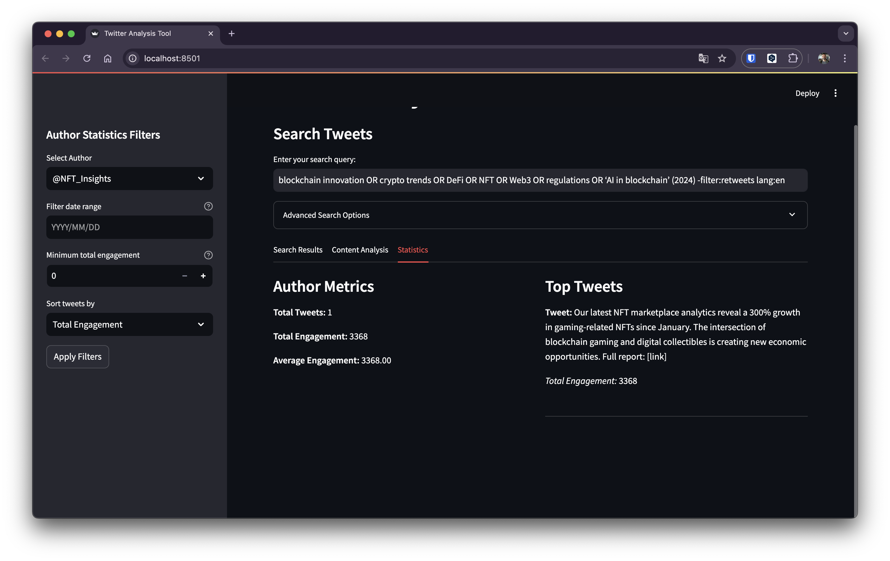

# Twitter Analytics Tool

AI-powered tool for analyzing Twitter content, detecting trends, and generating insights using GPT models.

## Search Examples

The tool supports complex search queries:

```
# Complex search with filters
"blockchain innovation OR crypto trends OR DeFi OR NFT OR Web3 OR regulations OR 'AI in blockchain' (2024) -filter:retweets lang:en"

# Simple AND operation
"Bitcoin AND crypto"

# Exclusion example
"Web3 -scam"

# Author-specific search
"from:VitalikButerin OR from:balajis OR from:cz_binance"

# Industry insights search
"blockchain insights OR crypto analysis OR 'thought leader' OR expert OR 'industry report' (2024) -filter:retweets lang:en"

# Trending topics search
"blockchain innovation OR crypto trends (2024) -filter:retweets lang:en"
```

### Search Operators
- `AND`: Matches both terms
- `OR`: Matches either term
- `"phrase"`: Exact phrase match
- `-term`: Excludes term
- `(year)`: Filter by year
- `lang:en`: Language filter
- `from:user`: Author filter

## Note on Implementation

Initially, the project was planned to use Twitter's API for real-time data. However, due to API rate limits and instability of alternative packages (tweepy, ntscraper), a curated JSON dataset was used for development and testing. In a production environment, the application can be easily modified to work with Twitter's official API, considering rate limiting strategies.

## Features

🔍 **Search**
- Complex query parsing with AND/OR operators
- Semantic search with GPT
- Filters by date, metrics, authors

📊 **Analytics**
- Topic detection
- Sentiment analysis
- Engagement metrics

📈 **Visualization**
- Interactive dashboards
- Trend analysis
- Author statistics

## Installation

```bash
# Clone repository
git clone https://github.com/yourusername/twitter-analytics.git

# Create virtual environment
python -m venv venv
source venv/bin/activate  # Linux/Mac
# or
venv\Scripts\activate     # Windows

# Install dependencies
pip install -r requirements.txt

# Set up environment variables
cp .env.example .env

# Update .env with your OpenAI API key:
OPENAI_API_KEY=your_api_key_here
```

## Usage

Launch the application:
```bash
streamlit run src/app.py
```

## Tech Stack

- Python 3.8+
- OpenAI GPT
- Streamlit
- Pandas
- AsyncIO
- python-dotenv
- JSON

## Project Structure

```
├── src/
│   ├── __init__.py       # Package initialization
│   ├── app.py            # Streamlit UI
│   ├── config.py         # Configuration settings
│   ├── gpt_analyzer.py   # GPT integration
│   ├── query_parser.py   # Search logic
│   └── search_prompts.py # GPT prompts
├── data/
│   └── mock_tweets.json  # Sample data
├── .env                  # OpenAI API key
├── .gitignore           # Git ignore rules
├── README.md            # Project documentation
└── requirements.txt     # Dependencies
```

## User Interface

### Search Interface
The tool provides an intuitive search interface with multiple filtering options:

**Key Search Features:**
- Complex query parsing (AND/OR operators, phrase matching)
- Advanced filters:
  - Date range selection
  - Minimum engagement thresholds
  - Author-specific searches

### Results Tabs

#### 1. Search Results Tab


**Features:**
- Displays matched tweets with full context
- Relevance scoring for each tweet
- Detailed engagement metrics (likes, retweets, replies)
- Semantic relevance explanation for each matched tweet

#### 2. Content Analysis Tab


**Insights Include:**
- **Popular Topics**
  - Topic name
  - Tweet count
  - Importance score
- **Top Keywords**
  - Most frequently used terms
- **Sentiment Overview**
  - Overall sentiment score
  - Sentiment summary
- **Active Discussions**
  - Most important tweet discussions
  - Context and significance

#### 3. Statistics Tab


**Author Metrics:**
- Total tweets
- Total engagement
- Average engagement per tweet
- Top performing tweets
- Engagement breakdown (likes, retweets, replies)

### Filtering Capabilities
- Select specific authors from search results
- Filter by:
  - Date range
  - Minimum engagement
  - Retweet count
  - Like count
  - Reply count
